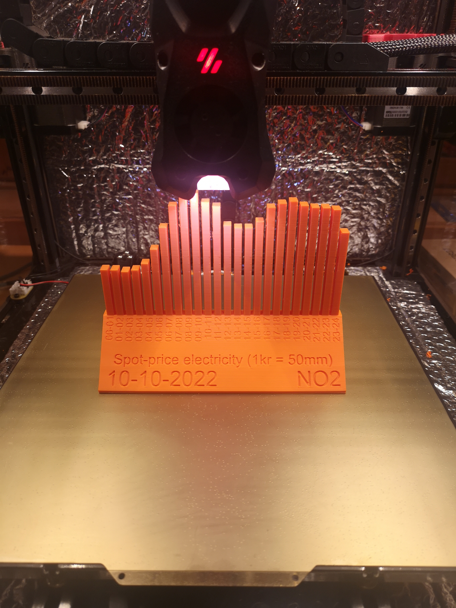

# Electricity Price BarChart Generator

The program generates an STL-file of a bar chart depicting electricity prices throughout a period of 24-hours for a selected area zone within Norway.

# Available Dates and Areas

The program provides electricity prices for dates back to and including 1 September 2022.
The supported regions are for Norway and the country is divided into five territories: North(Tromso), South (Kristiansand),  East(Oslo),  Middle(Trondheim, West(Bergen)

# Installation Instructions
Tested with Python 3.8.10

1. Clone the repository.
2. Create a virtual environment.
3. Install python dependencies using `pip install -r requirements.txt`
4. Run main.py

